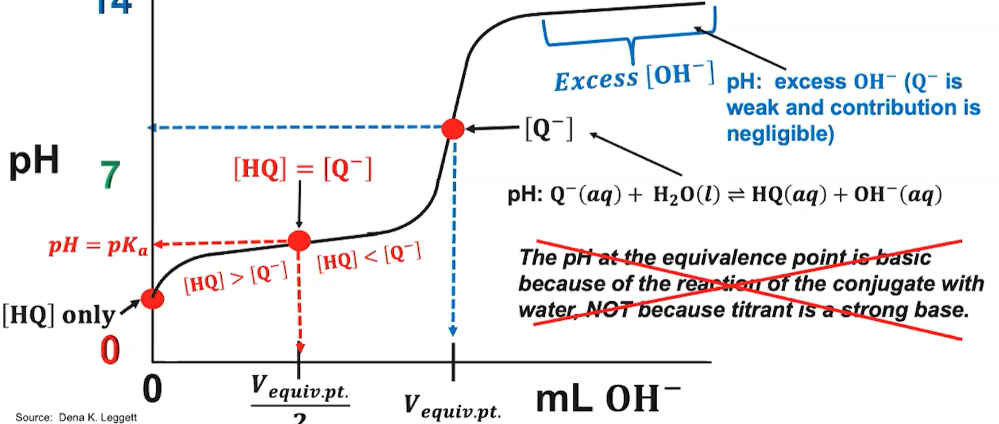
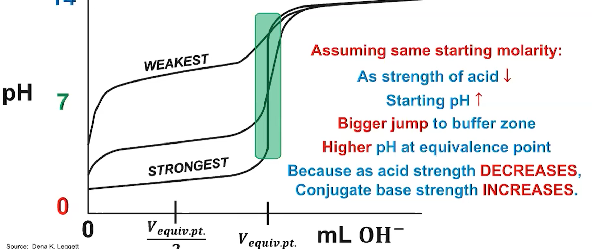

# 8.1 pH
$pH = -log[H_3O^+]$  

定义 $K_w = [H_3O^+][OH^-]$
(pK_w 时刻变化的)

# 8.2 Strong Acid & Base
代表几乎完全溶解

# 8.3 %ionization
根据初始浓度变化  
$ \%Ionization = 
    \frac{[H_3O^+]_{equ}或者
    [OH^-]_{equ}}
    {[Acid]_{init}}
$

> $K_a, K_b, K_w$  
    1. 方便比较;  
    2. 在酸碱中和时候 $K_a * K_b$ cancel成了 $K_w$

    
# 8.8/8.10 Buffer
一个缓冲带
大概例子: 如果有更多conjugate base 就能抵御加进来的acid

# 8.9 Henderson–Hasselbalch

> 证明:  
$K_a = \frac{[H3O^+][A^-]}{[HA]}$  
$[H3O^+] = K_a\frac{[HA]}{[A^-]}$, 取-log  
$\because log(ab) = log(a) + log(b)$  
$pH = pK_a - log(\frac{[HA]}{[A^-]})$  
$\because -log(a) = log(\frac{1}{a})$  
$pH = pK_a - log(\frac{[HA]}{[A^-]}) = pK_a + log(\frac{[A^-]}{[HA]})$

  

# 8.4 中和
如果是strong acid+base直接计算, 溶液的pH取决反应剩下的酸碱哪个多

其余的情况需要equilbrium

例子是 weak acid + strong base (假设$OH^-$全溶解)   
在对net ionic equation 做stoichiometry后  
处理那个acid和其conjugate base的 equilbrium

Equivance Point 定义为  
正好加上足够的物质反应掉只剩下conjugates, 这时候pH是conjugates决定的

Half Equivance Point: 
- $ [Acid] = \frac{1}{2}[Base]$ (strong acid + weak base 混合后反应前)   
这时 $pH = pK_b$  

- $ [Base] = \frac{1}{2}[Acid]$ (weak acid + strong base 混合后反应前)  
这时 $pH = pK_a$

> 根据 Henderson–Hasselbalch equation 证明:  
    对于 $[HA]$ (某种弱酸) 加上其一半 $OH^-$(strong base) 这时候  
    剩下一半的 $[HA]$ 生成一半的 $[A^-]$  
    $[A^-] = [HA]$  
    根据 $pH = pK_a + log \frac{[A^-]}{HA}$  
    $pH = pK_a$   
    对于strong acid + weak base 则是  
    剩下一半的 weak base 生成一半的conjugate acid  
    带入$pH = pK_b + log \frac{[BH^+]}{B}$  

> Salt of Conjugate Acid/Base -> buffer solution  
    原理是common-ion effect

# 8.5 Titration
Dominant Species:

(这个打叉的部分个人没看懂为什么不对, GPT说是对的不该打叉)

Buffer Zone:

> 酸的强度越弱 共轭碱越强 等定点pH越高

> 弱酸$pK_a$ 更大 bufferzone更高

> 弱碱$pK_b$ 更小 bufferzone更低

> 酸的强弱决定了初始点高低因为初始点只有酸

# 8.6 Molecular Struct of Acid/Base
结论大概是 strong acid 的H-X bond更弱  
strong acid的conjugate更弱  
对于base类似

TODO

# 8.7 $pH$和$pK_a$

> 还是根据 Henderson–Hasselbalch 等式  
    如果其中一个更大 log项就得是正/负  
    ($log(x)$ (x<1) 代表一个数的小于0次方)  
    也就代表酸/碱更多

# 8.11 
这个视频大概是应用了equilibrium这套东西来解决类似7.11的应用题